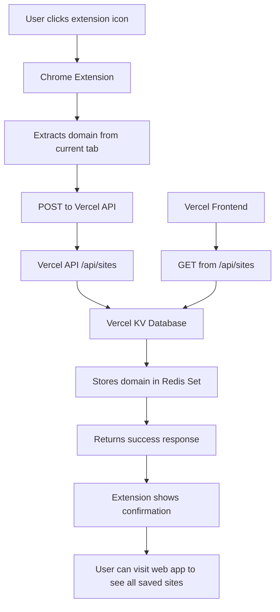

# Quick Listicle

A Chrome extension that saves website domains to a personal collection stored in the cloud.

## 🚀 Live Demo

- **Web App**: [https://quick-listicle-su1eu9mi0-coolstoryjoes-projects.vercel.app](https://quick-listicle-su1eu9mi0-coolstoryjoes-projects.vercel.app)

## 🏗️ Architecture



## 📁 Project Structure

```
Quick-Listicle/
├── extension/              # Chrome extension source
│   ├── manifest.json      # Extension configuration
│   ├── popup.html         # Extension popup UI
│   ├── popup.js          # Extension logic
│   └── icons/            # (Empty - needs icon files)
│       └── README.md
├── vercel-app/            # Next.js Vercel application
│   ├── src/app/
│   │   ├── api/sites/route.ts    # API endpoints
│   │   ├── page.tsx              # Frontend UI
│   │   └── layout.tsx
│   ├── package.json
│   └── vercel.json        # Vercel configuration
└── README.md             # This file
```

## 🛠️ How It Works

1. **Chrome Extension**: Click the extension icon on any website to save its domain
2. **Domain Extraction**: Automatically extracts the clean domain (e.g., `google.com` from `https://www.google.com/search`)
3. **Storage**: Saves to Vercel KV (Redis) for persistence
4. **Web Interface**: Visit the deployed Vercel app to see all saved domains

## 🔧 Setup Instructions

### Option 1: Load Extension in Chrome (Recommended for Testing)

1. Open Chrome and go to `chrome://extensions/`
2. Enable "Developer mode" (top right)
3. Click "Load unpacked"
4. Select the `extension/` folder from this project
5. The extension will appear in your toolbar

**Note**: Icons are not included yet - the extension will use a default puzzle piece icon until real icons are added.

### Option 2: Package for Chrome Web Store

1. Add icon files to `extension/icons/` (see `extension/icons/README.md`)
2. Update `extension/manifest.json` to include the icons field
3. Use Chrome's "Pack extension" feature or build system

## 🎯 Features

- **Clean UI**: Simple, elegant interface inspired by modern web design
- **Domain Storage**: Saves just the domain name (unique, no duplicates)
- **Real-time Feedback**: Immediate confirmation when sites are saved
- **Web Interface**: Dedicated webpage to view and click through saved sites
- **Cloud Storage**: Persistent storage using Vercel KV (Redis)
- **Fast & Lightweight**: Minimal code, fast loading

## 📋 API Endpoints

- `GET /api/sites` - Retrieve all saved domains
- `POST /api/sites` - Save a new domain

**Example requests:**
```bash
# Get all sites
curl https://your-app.vercel.app/api/sites

# Save a domain
curl -X POST https://your-app.vercel.app/api/sites \
  -H "Content-Type: application/json" \
  -d '{"domain": "example.com"}'
```

## 🔒 Security

- API validates domain format before saving
- CORS configured for the extension
- No user authentication (shared collection)

## 🚧 Known Issues / Todos

- [ ] Add extension icons (currently using default Chrome icon)
- [ ] Add timestamps to saved domains
- [ ] Support saving full URLs instead of domains
- [ ] Add user accounts for personal collections
- [ ] Rate limiting for API endpoints

## 💻 Tech Stack

- **Frontend**: Next.js 15, TypeScript, Tailwind CSS
- **Backend**: Next.js API Routes
- **Database**: Vercel KV (Redis)
- **Deployment**: Vercel
- **Extension**: Chrome Manifest V3

## 🤝 Contributing

1. Clone the repository
2. Make changes to the code
3. Test locally (extension) and deploy (Vercel)
4. Submit a pull request

## 📝 License

MIT License - feel free to modify and distribute.

## 🔄 Deployment

The Vercel app is automatically deployed when pushing to the main branch. Make sure to:

1. Set up Vercel KV in your Vercel project
2. The API endpoints work automatically with the deployed URL

---

Built with ❤️ using Next.js and Chrome Extensions
